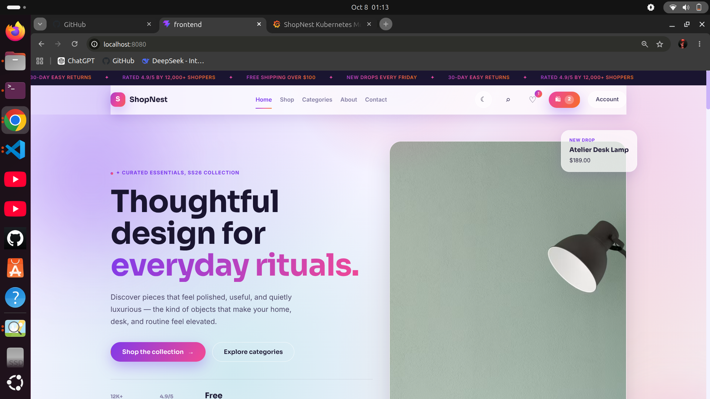
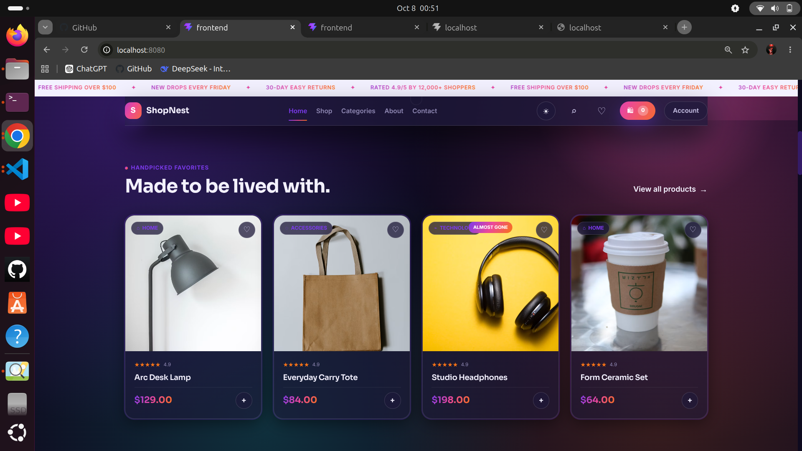
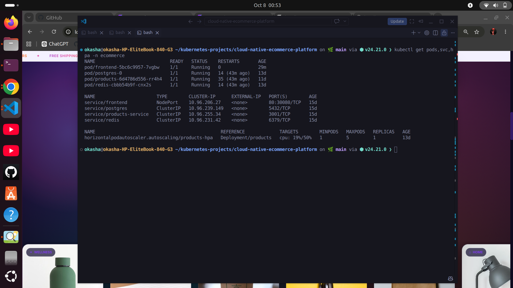
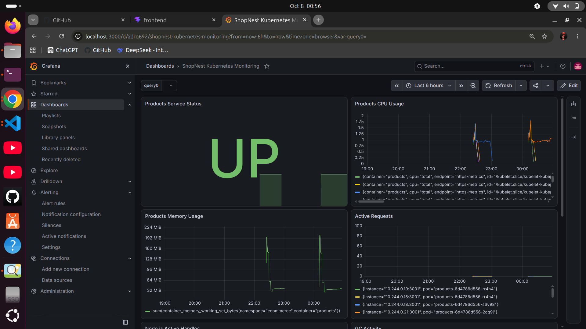

# ShopNest — Kubernetes Cloud-Native E-Commerce Platform

A production-oriented cloud-native e-commerce platform built to demonstrate practical **Docker, Kubernetes, Helm, autoscaling, persistent storage, self-healing, and observability** concepts.

The project takes a containerized e-commerce application and deploys it on Kubernetes with reusable Helm configuration, PostgreSQL persistent storage, Redis, health probes, resource management, Horizontal Pod Autoscaling, Prometheus metrics, and Grafana monitoring.

---

## 📌 Project Overview

Modern e-commerce applications need more than application code. They must be able to:

* Run consistently across environments
* Recover automatically from application failures
* Scale when workload increases
* Preserve database data across pod restarts
* Allow services to communicate reliably
* Expose application health and metrics
* Provide operational visibility
* Support repeatable Kubernetes deployments

**ShopNest** was built as a practical DevOps/Kubernetes project to demonstrate how these requirements can be addressed using containerization and cloud-native infrastructure.

---

## 🎯 Project Goals

The main goals of this project are to demonstrate:

* Containerized application deployment with Docker
* Kubernetes application orchestration
* Stateless and stateful workload management
* Kubernetes Services and internal DNS
* Persistent storage using PostgreSQL + PVC
* Configuration management using ConfigMap and Secret
* Liveness and readiness probes
* CPU and memory resource management
* Kubernetes self-healing
* Horizontal Pod Autoscaling
* Prometheus metrics collection
* Grafana observability
* Helm-based Kubernetes packaging
* Practical troubleshooting and verification

---

## 🏗️ Architecture

```text
                         ┌─────────────────────┐
                         │      User / Browser  │
                         └──────────┬──────────┘
                                    │
                                    ▼
                         ┌─────────────────────┐
                         │  Frontend / Nginx   │
                         │      React App       │
                         └──────────┬──────────┘
                                    │
                           Kubernetes Service
                                    │
                                    ▼
                         ┌─────────────────────┐
                         │    Products API     │
                         │   Node.js / Express  │
                         └───────┬───────┬─────┘
                                 │       │
                     ┌───────────┘       └───────────┐
                     ▼                               ▼
             ┌──────────────┐                 ┌──────────────┐
             │  PostgreSQL  │                 │    Redis     │
             │ StatefulSet  │                 │  Deployment  │
             │    + PVC     │                 └──────────────┘
             └──────────────┘

                         Monitoring
                              │
                  Products API /metrics
                              │
                              ▼
                    ┌──────────────────┐
                    │   ServiceMonitor │
                    └────────┬─────────┘
                             │
                             ▼
                    ┌──────────────────┐
                    │    Prometheus    │
                    └────────┬─────────┘
                             │
                             ▼
                    ┌──────────────────┐
                    │     Grafana      │
                    └──────────────────┘
```

---

## 🧰 Technology Stack

### Application

* React
* Vite
* Node.js
* Express
* PostgreSQL
* Redis
* Nginx

### Containers

* Docker
* Docker Compose

### Kubernetes

* Kubernetes
* Deployments
* StatefulSet
* Services
* ConfigMap
* Secret
* PersistentVolumeClaim
* Liveness Probes
* Readiness Probes
* Resource Requests/Limits
* Horizontal Pod Autoscaler
* Kubernetes DNS

### DevOps / Observability

* Helm
* Prometheus
* Grafana
* Prometheus `ServiceMonitor`
* `prom-client`

---

## 📸 Project Showcase

### ShopNest Application — Homepage



### ShopNest Application — Product Page



### Kubernetes Workloads



### Grafana Monitoring



---

## 📁 Project Structure

```text
cloud-native-ecommerce-platform/
│
├── docker/
│   └── docker-compose.yml
│
├── frontend/
│   ├── src/
│   ├── public/
│   ├── Dockerfile
│   ├── nginx.conf
│   └── package.json
│
├── services/
│   └── products/
│       ├── src/
│       ├── migrations/
│       ├── Dockerfile
│       ├── package.json
│       └── .env.example
│
├── k8s/
│   ├── namespace.yaml
│   ├── configmap.yaml
│   ├── secret.yaml
│   ├── frontend.yaml
│   ├── frontend-service.yaml
│   ├── products.yaml
│   ├── products-service.yaml
│   ├── postgres.yaml
│   ├── postgres-service.yaml
│   ├── redis.yaml
│   ├── redis-service.yaml
│   ├── hpa.yaml
│   └── products-servicemonitor.yaml
│
├── helm/
│   └── shopnest/
│       ├── Chart.yaml
│       ├── values.yaml
│       └── templates/
│
├── package.json
└── README.md
```

---

# 🐳 Docker Deployment

The application can first be run using Docker Compose.

The Compose environment includes:

* Products API
* PostgreSQL
* Redis

The frontend can also be containerized using its dedicated Dockerfile and Nginx configuration.

### Start backend dependencies and API

```bash
docker compose -f docker/docker-compose.yml up -d
```

### Check containers

```bash
docker compose -f docker/docker-compose.yml ps
```

### Test Products API

```bash
curl http://localhost:3001/api/products
```

---

# ☸️ Kubernetes Deployment

The Kubernetes deployment separates the application into multiple workloads.

### Namespace

The application runs inside:

```text
ecommerce
```

### Main workloads

| Component    | Kubernetes Resource |
| ------------ | ------------------- |
| Frontend     | Deployment          |
| Products API | Deployment          |
| PostgreSQL   | StatefulSet         |
| Redis        | Deployment          |

This separation allows stateless application workloads and stateful database workloads to be managed differently.

---

## 🔗 Kubernetes Services

The application uses Kubernetes Services for stable networking and service discovery.

```text
frontend           → NodePort
products-service   → ClusterIP
postgres           → ClusterIP
redis              → ClusterIP
```

The Products API communicates with PostgreSQL and Redis using Kubernetes service names rather than hard-coded pod IP addresses.

---

# 💾 Persistent PostgreSQL Storage

PostgreSQL is deployed as a Kubernetes StatefulSet with persistent storage.

The database uses a:

```text
PersistentVolumeClaim
```

This ensures database storage is not tied directly to the lifecycle of an individual PostgreSQL pod.

The application therefore demonstrates an important Kubernetes distinction:

* **Deployments** → primarily used for stateless workloads
* **StatefulSet** → used for stateful workloads such as PostgreSQL

---

# ⚙️ Configuration Management

Application configuration is separated from container images.

### ConfigMap

Non-sensitive configuration is managed using Kubernetes ConfigMap resources.

### Secret

Sensitive configuration such as the database password is represented using a Kubernetes Secret.

The repository contains only a placeholder value:

```text
CHANGE_ME
```

Actual local environment files are excluded from Git using `.gitignore`.

---

# ❤️ Health Checks

The application uses Kubernetes health probes to improve workload reliability.

### Liveness Probe

The liveness probe helps Kubernetes determine whether a container is still functioning.

If the application becomes unhealthy, Kubernetes can restart the affected container.

### Readiness Probe

The readiness probe determines whether the application is ready to receive traffic.

An unhealthy pod can therefore be removed from Service endpoints while remaining alive.

This provides an important distinction:

```text
Liveness  → Should Kubernetes restart it?
Readiness → Should Kubernetes send traffic to it?
```

---

# 🔄 Self-Healing

Kubernetes self-healing behavior was verified as part of the project.

The platform uses Kubernetes controllers to maintain the desired number of application replicas.

If an application pod becomes unavailable, Kubernetes can recreate it and restore the desired state.

This demonstrates the core Kubernetes reconciliation model:

```text
Desired State
      ↓
Kubernetes Controllers
      ↓
Actual Cluster State
      ↓
Reconciliation
      ↓
Desired State Restored
```

---

# 📈 Horizontal Pod Autoscaling

The Products API includes a Kubernetes Horizontal Pod Autoscaler.

Configured behavior:

```text
Minimum replicas: 1
Maximum replicas: 5
CPU target:       50%
```

The HPA uses resource utilization to determine when additional replicas may be required.

This demonstrates horizontal scaling rather than vertically increasing the resources of a single pod.

---

# 📊 Monitoring & Observability

The project integrates Prometheus and Grafana for Kubernetes monitoring.

The Products API exposes a Prometheus-compatible metrics endpoint:

```text
/metrics
```

The Node.js service uses:

```text
prom-client
```

and enables default process metrics.

Example metrics include:

```text
process_cpu_user_seconds_total
process_cpu_system_seconds_total
process_cpu_seconds_total
process_resident_memory_bytes
process_virtual_memory_bytes
```

---

## Prometheus ServiceMonitor

The Products API is monitored through a Kubernetes `ServiceMonitor`.

The monitoring flow is:

```text
Products API
     │
     │ /metrics
     ▼
Products Service
     │
     ▼
ServiceMonitor
     │
     ▼
Prometheus
     │
     ▼
Grafana
```

The ServiceMonitor is configured to scrape the Products API metrics endpoint every:

```text
15 seconds
```

---

## Monitoring Verification

The monitoring stack was verified in the Kubernetes cluster.

Verified components include:

* Prometheus → Running
* Grafana → Running
* Prometheus Service → Available on port `9090`
* Grafana Service → Available on port `80`
* Products ServiceMonitor → Present
* Prometheus healthy scrape targets → Verified
* Products API `/metrics` endpoint → Verified
* Grafana UI → Accessible

The Products API metrics endpoint was directly tested from inside the Kubernetes pod and returned valid Prometheus metrics.

---

# 📦 Helm

The project includes a reusable Helm chart:

```text
helm/shopnest/
```

The chart packages the Kubernetes resources required by the application.

### Helm capabilities demonstrated

* Parameterized configuration
* Reusable Kubernetes templates
* Application deployment through Helm
* Helm upgrades
* Helm linting
* Helm rendering
* Helm-based isolated testing

### Validate the chart

```bash
helm lint helm/shopnest
```

### Render manifests

```bash
helm template shopnest helm/shopnest
```

Example installation:

```bash
helm install shopnest helm/shopnest \
  --namespace helm-test \
  --create-namespace
```

---

# 🧪 Verification & Testing

The project was progressively verified at multiple layers.

### Frontend

```bash
npm --prefix frontend run lint
npm --prefix frontend run build
```

### Docker

```bash
docker compose -f docker/docker-compose.yml ps
```

### Products API

```bash
curl http://localhost:3001/api/products
```

### Kubernetes

```bash
kubectl get pods -n ecommerce
kubectl get svc -n ecommerce
```

### Helm

```bash
helm lint helm/shopnest
helm template shopnest helm/shopnest
```

### Monitoring

```bash
kubectl get pods -n monitoring
kubectl get svc -n monitoring
```

Products metrics:

```bash
kubectl exec -n ecommerce <products-pod> -- \
  wget -qO- http://localhost:3001/metrics
```

---

# 🔐 Security

The repository is designed to avoid committing real credentials.

Sensitive local environment files are ignored through `.gitignore`.

Example configuration files use placeholders such as:

```text
CHANGE_ME
```

Before deploying outside a local development environment, secrets should be supplied through an appropriate secret-management mechanism rather than committed to source control.

---

# 🧠 DevOps Concepts Demonstrated

This project provides practical implementation experience with:

* Containerization
* Docker image creation
* Docker Compose
* Kubernetes architecture
* Deployments
* StatefulSets
* Services
* Kubernetes DNS
* ConfigMaps
* Secrets
* Persistent storage
* Health probes
* Resource management
* Self-healing
* Horizontal Pod Autoscaling
* Prometheus metrics
* ServiceMonitor
* Grafana
* Helm
* Kubernetes troubleshooting
* Application and infrastructure verification

---

# 🚀 What This Project Demonstrates

Rather than only deploying an application to Kubernetes, this project focuses on the operational capabilities around the application.

The implementation demonstrates how Kubernetes can provide:

```text
Containerization
       ↓
Orchestration
       ↓
Service Discovery
       ↓
Persistent Storage
       ↓
Health Management
       ↓
Self-Healing
       ↓
Autoscaling
       ↓
Observability
       ↓
Repeatable Helm Deployment
```

---

# 🔮 Future Improvements

Possible future improvements include:

* CI/CD pipeline integration
* External cloud deployment
* Ingress with TLS
* Managed PostgreSQL
* External secret management
* Centralized logging
* Distributed tracing
* Multi-node production cluster
* Automated load testing
* Advanced alerting

These are intentionally listed as future improvements rather than presented as already implemented features.

---

# 👨‍💻 Project Focus

This project was developed as a practical **DevOps and Kubernetes portfolio project**, with emphasis on understanding how application workloads are containerized, orchestrated, monitored, scaled, and operated using cloud-native tooling.

The project demonstrates hands-on work with:

**Docker → Kubernetes → Helm → Prometheus → Grafana**

---

## ⭐ Key Takeaway

ShopNest demonstrates a complete local cloud-native deployment workflow:

```text
Application
    ↓
Docker
    ↓
Kubernetes
    ↓
Persistent Storage
    ↓
Health & Self-Healing
    ↓
Autoscaling
    ↓
Prometheus
    ↓
Grafana
    ↓
Helm
```

The goal is not simply to run an e-commerce application, but to demonstrate the **DevOps engineering practices required to operate it reliably on Kubernetes**.
